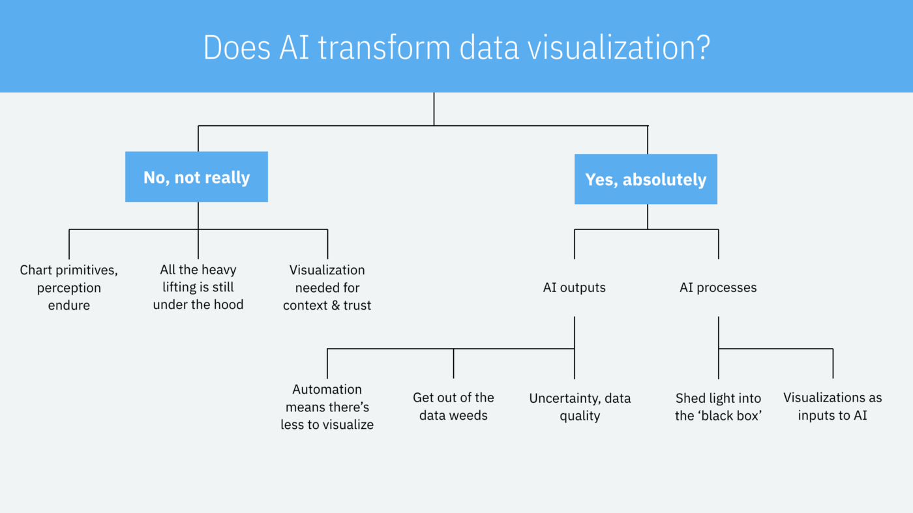

 **Programa Académico Especial PAE** 
# Deep Learning

Introducción al análisis de datos con técnicas de inteligencia artificial.

Profesor: Luis Fernando Carvajal Serna.

## Contenidos
[Introduccion](https://nbviewer.jupyter.org/github/camilogutierrez/MachineLearning/blob/master/MachineLearning.ipynb)

**1. Neural Networks and Deep Learning** 

[Notas del curso](https://nbviewer.jupyter.org/github/camilogutierrez/MachineLearning/blob/master/DeepLearning.ipynb)
* [**Homework 0: Python**](https://nbviewer.jupyter.org/github/camilogutierrez/MachineLearning/blob/master/Python_Basics_With_Numpy_v3a.ipynb)
* [**Homework 1: Logistic Regression as a Neural Network**](https://nbviewer.jupyter.org/github/camilogutierrez/MachineLearning/blob/master/Logistic_Regression_with_a_Neural_Network_mindset_v6a.ipynb)
* [**Homework 2: One hidden layer**](https://nbviewer.jupyter.org/github/camilogutierrez/MachineLearning/blob/master/Planar_data_classification_with_onehidden_layer_v6c.ipynb)
* [**Homework 3: Deep_Neural_Network_Step_by_Step**](https://nbviewer.jupyter.org/github/camilogutierrez/MachineLearning/blob/master/Building_your_Deep_Neural_Network_Step_by_Step_v8a.ipynb)
* [**Deep Neural Application**](https://nbviewer.jupyter.org/github/camilogutierrez/MachineLearning/blob/master/Deep_Neural_Network_Application_v8.ipynb)

**2. Improving Deep Neural Networks: Hyperparameter tuning, Regularization and Optimization** 

[Notas del curso](https://github.com/camilogutierrez/MachineLearning/blob/master/Improving_DeepLearning.ipynb)
* [**Homework 1: Initialization**](https://nbviewer.jupyter.org/github/camilogutierrez/MachineLearning/blob/master/Initialization.ipynb)
* [**Homework 2: Regularization**](https://nbviewer.jupyter.org/github/camilogutierrez/MachineLearning/blob/master/Regularization_v2a.ipynb)
* [**Homework 3: Optimization**](https://nbviewer.jupyter.org/github/https://github.com/camilogutierrez/MachineLearning/blob/master/Optimization_methods_v1b.ipynb)

## Autor

* **Camilo Gutierrez** - *cagutierrezra@unal.edu.co* 

## License

This project is licensed under the MIT License - see the [LICENSE.md](LICENSE.md) file for details
